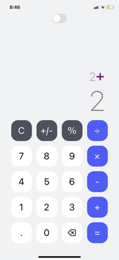

# Mobile Calculator App

This repository contains the source code for a mobile calculator app built using React Native. The app allows users to perform basic arithmetic operations such as addition, subtraction, multiplication, and division on their mobile devices.

## App Availability

You can download the app at [App Link](https://expo.dev/@carrot_28/calculator-mobile)

## Features

-   Simple and intuitive user interface.

-   Perform basic arithmetic operations: addition, subtraction, multiplication, and division.

-   Clear button to reset the calculator.

-   Support for decimal numbers.

-   Responsive design, suitable for various screen sizes.

-   Light and Dark mode

## Installation

<details>
<summary>
  <code>There are several ways to save this repository on your device. Two of these options include:</code>
</summary>

-   [Downloading repository as ZIP](https://github.com/carrot2803/Mobile-Calculator-App/archive/refs/heads/master.zip)
-   Running the following command in a terminal, provided the [GitHub CLI](https://cli.github.com/) has been previously installed:

```sh
git clone https://github.com/carrot2803/Mobile-Calculator-App.git
```

<code>Install React and dependencies: </code>

Run the following command to install the required dependencies:

```sh
npm i
```

Run the app: Connect your device or emulator, and run the following command to launch the app:

```sh
npm start
```

</details>

## Snippets

Splash Screen


Light Screen


Dark Screen

